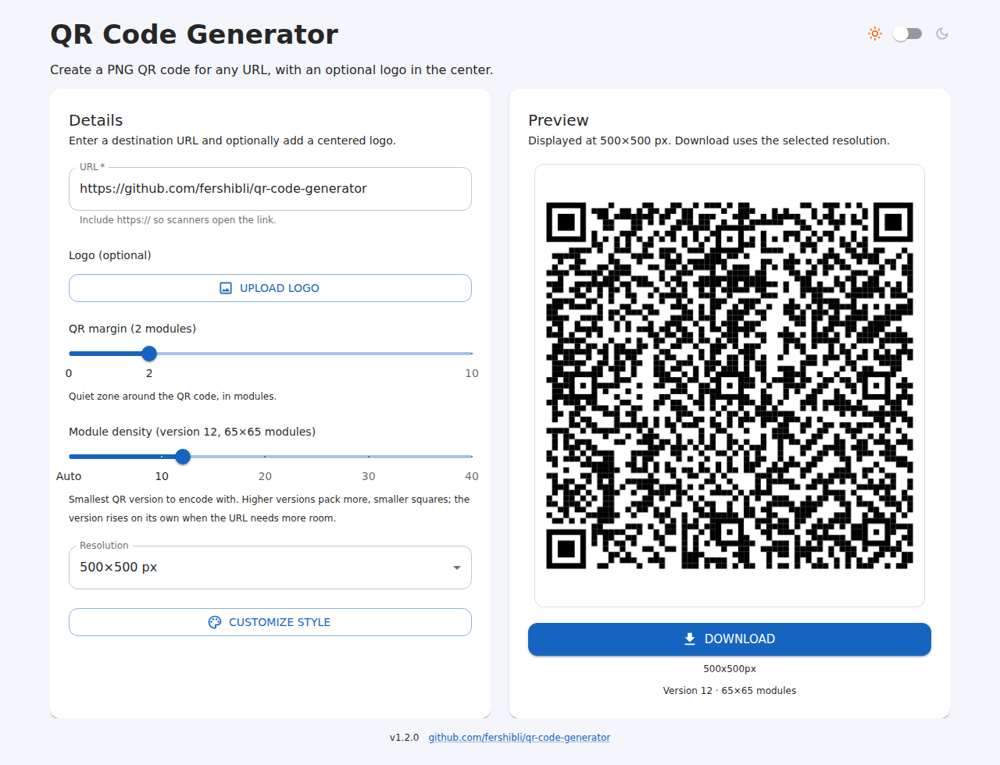
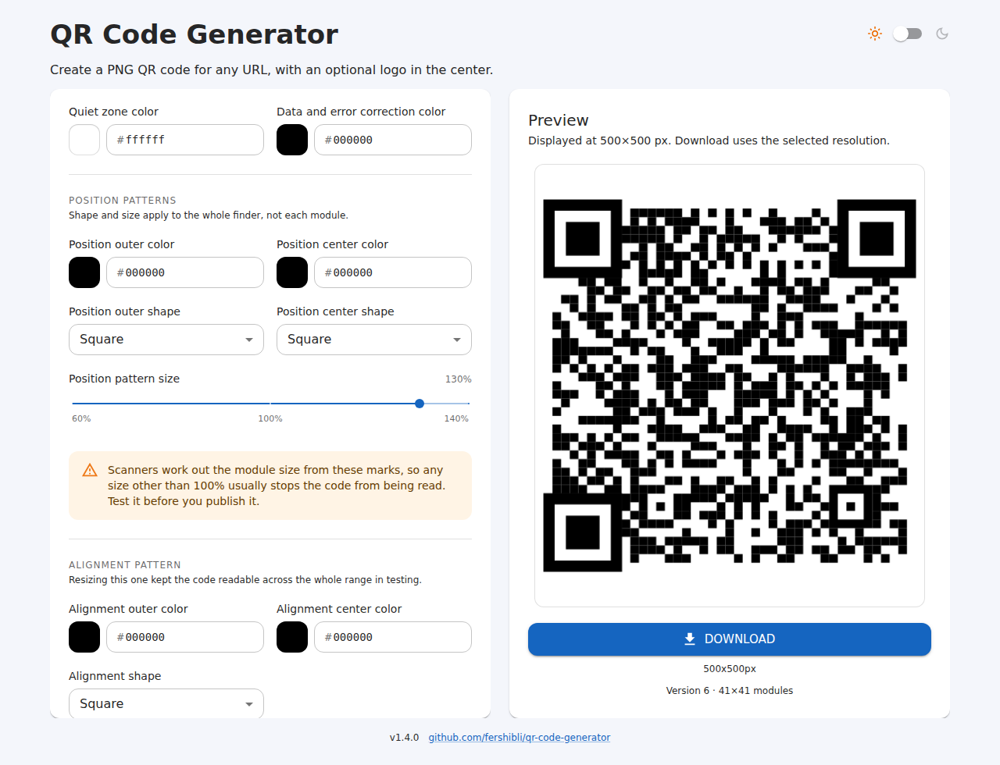
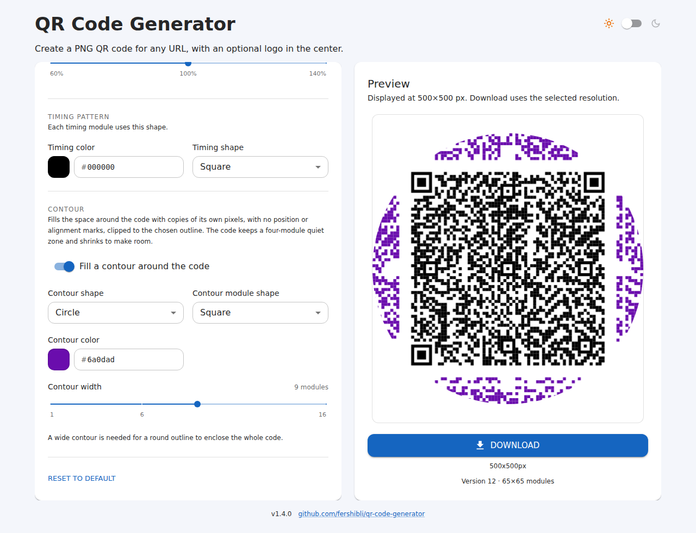
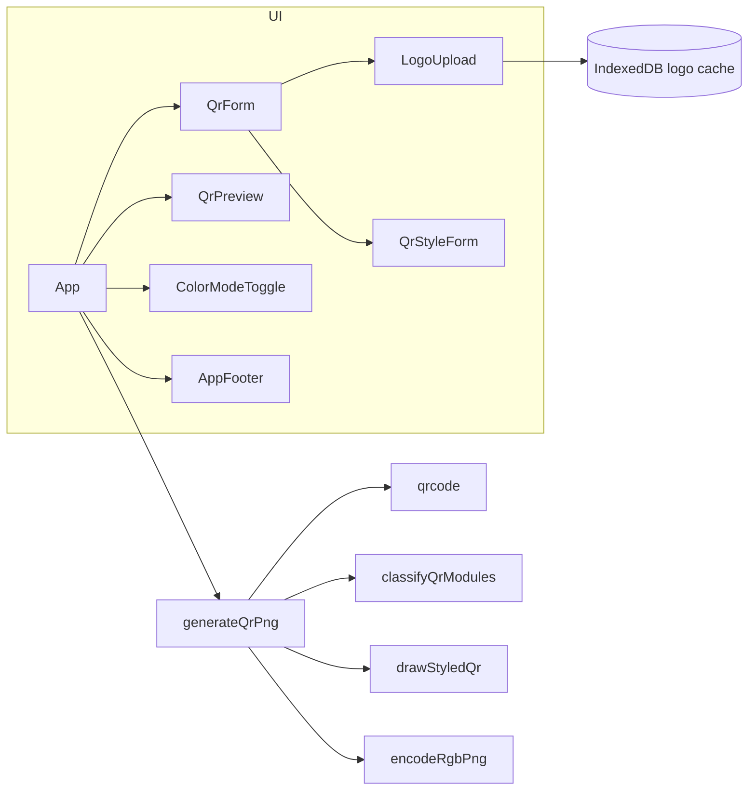

# QR Code Generator

A single-page React app that turns a URL into an RGB PNG QR code, with an optional centered logo.

**Live:** [fershibli.github.io/qr-code-generator](https://fershibli.github.io/qr-code-generator/)

## Table of contents

- [Features](#features)
- [How to use](#how-to-use)
- [Scannability](#scannability)
- [Architecture](#architecture)
- [Tech stack](#tech-stack)
- [Development](#development)
- [Deploy](#deploy)
- [Backlog](#backlog)

## Features

- Encode any URL into a square PNG QR code (no alpha channel).
- URL field pre-filled with `https://` and checked locally when you leave it — green when valid, red with a reason when not.
- **Module density**: force a minimum QR version (automatic through 40) to pack more, smaller squares into the same URL. The preview caption reports the version and module count that were actually encoded.
- Optional centered logo, with size and padding sliders that appear only after a logo is selected.
- Collapsible **Customize style** controls for quiet-zone, data, finder, alignment, and timing colors and shapes. Finder and alignment shapes apply to the whole pattern (square, rounded, circle, or triangle), not each module.
- **Position and alignment mark size** (60–140%), applied to the whole mark. The 7×7 finder box the spec defines never moves; only the drawn shape grows or shrinks around its center.
- **Contour fill**: wrap the code in a circle, square, rounded square, or diamond filled with copies of the code's own data modules — no position, alignment, or timing marks, their places taken by other data modules so the band has no holes — from 1 to 16 modules wide.
- On desktop the form scrolls inside the left card so the preview stays in view. On mobile the preview sits above the form; a compact 20vh bar (QR + Download) appears only while that card is scrolled out of view.
- Optional transparent logo backing so QR modules show through around the logo (the PNG stays opaque RGB). The switch is on the form, below the logo upload, and only appears after a logo is selected.
- Adjustable quiet-zone margin (0–10 modules).
- Export resolution from 250×250 through 1750×1750 px, in 250 px steps.
- **Advanced resolution** (off by default) swaps the preset list for a free width, height, and unit — px, mm, cm, in, pt, or pc — so the export can be sized for print and does not have to be square.
- Downloads named after the encoded URL, such as `a.com.br-500px.png`, or `a.com.br-500x750px.png` when the export is not square.
- Live preview always shown at 500×500 CSS pixels; download uses the selected resolution.
- Light and dark theme, following the system by default or a stored preference.
- Last 8 logos cached in IndexedDB for one-click reuse (removing the current logo does not clear the cache).
- Footer with the app version and a link to this repository.

## How to use

Open the [live app](https://fershibli.github.io/qr-code-generator/) or run it locally with `npm install` and `npm run dev`.

### 1. Start from the empty generator

The left card is the form. The right card stays empty until a URL is entered; **Download** is disabled.


### 2. Enter a URL

The field starts out holding `https://`, so you only type the rest. The preview updates after a short debounce, and nothing is generated while the field still holds the scheme alone.

Leaving the field checks the address locally — no request is made. A valid one is confirmed in green (`Valid URL — points to a.com.br.`); a bad one turns the field red with the reason: a missing scheme, spaces, a host with no domain ending, or a malformed domain. Once checked, the message follows what you type, so a fix clears it straight away. Other schemes such as `mailto:` are accepted with a note that scanners may not open them as a web page.


- **QR margin** is the quiet zone around the code, in modules (default 2).
- **Module density** is the smallest QR version to encode with (default automatic).
- **Resolution** is the exported PNG size. The preview stays 500×500 px; the caption under **Download** shows the file size, such as `500x500px`.
- **Advanced resolution** is a checkbox under that field, unchecked by default. Checking it replaces the preset list with **Width**, **Height**, and **Unit**, seeded from the resolution that was selected.
- **Customize style** expands a Style section on the same card: quiet-zone and data colors, finder/alignment/timing colors and shapes (square, rounded, circle, or triangle), position and alignment mark sizes, the contour fill, and **Reset to default**. Finder and alignment use one shape for the whole mark.

### 3. Size the export yourself

Check **Advanced resolution** to type the size instead of picking one. **Width** and **Height** take decimals and **Unit** covers pixels, millimeters, centimeters, inches, points, and picas; physical units convert at 96 px to the inch, the density browsers and design tools assume. Switching the unit restates the same size rather than reusing the number, so 500 px becomes 5.21 in.

Each side is clamped to 64–4096 px once converted. The code itself stays square: on a rectangular export it is drawn at the shorter side, centered, with the quiet-zone color filling the rest — so the PNG matches the size you asked for and the code stays scannable.

Unchecking the box goes back to the preset resolution that was selected.

### 4. Make the code denser

The number of squares is not a free choice: it comes from the QR *version*, which fixes the matrix at `4 × version + 17` modules per side. **Module density** sets the smallest version to encode with, from **Auto** through **40**, so the same short URL can be packed into a much finer grid.



The app encodes once automatically and only re-encodes at your version when it is higher, so a long URL never fails because of this setting — it just keeps the version it needs. The caption under **Download** shows what came out, such as `Version 12 · 65×65 modules`.

### 5. Resize the position and alignment marks

Under **Customize style**, **Position pattern size** and **Alignment pattern size** scale the whole drawn mark (60–140%) around its own center. The underlying modules stay exactly where the spec puts them; only the drawing changes.



Resizing the position marks is the one setting here that breaks scanning — see [Scannability](#scannability) — so the form warns as soon as it leaves 100%.

### 6. Wrap the code in a contour

**Contour** fills the space around the code with copies of its own pixels, clipped to an outline. Only data modules repeat: no second set of position or alignment marks is ever painted, so a scanner still sees exactly one code. Where a position, alignment, or timing mark falls in the tiling, another data module of the same code is drawn in its place, so the band keeps an even texture instead of showing the mark's silhouette as a gap.



- **Contour shape** is the outline the fill is clipped to: circle, square, rounded square, or diamond.
- **Contour module shape** and **Contour color** style the repeated pixels.
- **Contour width** is how many modules the band adds on each side (1–16). A round outline needs a wide band — roughly 8 modules or more — before it can enclose the whole code.
- **QR margin**, back in **Output**, is the gap between the code and the band. Set it to 0 to have them touch.

**QR margin** doubles as the gap between the code and the fill: at 0 the band starts right at the code, so the two read as one field of pixels. The code shrinks to make room for the band, so the exported PNG stays the resolution you picked, and a centered logo shrinks with the code, keeping the same share of it.

### 7. Optionally add a logo

**Upload logo** accepts an image. Logo size (10–40%), logo padding (0–25%), and **Transparent logo background** appear only when a file is selected. Recent logos stay under the upload control for reuse. Transparent backing skips the opaque rectangle behind the logo so modules (and the logo’s own pixels) show through.


Click **Download** to save the PNG. The file is named after the URL it encodes plus the export size — `https://a.com.br` at 500×500 saves as `a.com.br-500px.png`. The scheme, `www.`, and any trailing slash are dropped, accents are folded, anything else unsafe for a file name becomes a dash, and a URL that leaves nothing usable falls back to `qr-code`. Removing the current logo does not delete it from recents.

### 8. Switch light and dark mode

Use the sun/moon switch in the header. The choice is stored in `localStorage` (`color-mode`). The QR preview frame uses the quiet-zone color so it matches the exported PNG.


## Scannability

Every option here was checked by generating the PNG in the running app (Playwright) and decoding it with [`jsQR`](https://github.com/cozmo/jsQR), not just by looking at it.

| Setting | Still decodes |
| --- | --- |
| Baseline, no styling | ✅ |
| Module density, up to version 40 | ✅ |
| Contour fill, any outline or width | ✅ |
| Alignment pattern size, 60–140% | ✅ |
| Contour gap (QR margin), 0–6 modules | ✅ |
| Position pattern size, anything but 100% | ❌ at every step from 60% to 140% |

Scanners derive the module size from the three position patterns, so a mark drawn larger or smaller than its 7×7 box makes the decoder sample the grid at the wrong pitch. The control is still there — other generators offer it too — but the style form shows a warning while it is off 100%, and codes made that way should be tested on a real scanner before being published.

The contour fill never repeats a function pattern, which is what keeps it from competing with the real position marks. The modules substituted in their place are picked from the code's own data with a hash of the lattice position, so the band is dense and repeatable without ever tracing a mark. The gap between the code and the fill is yours to set: decoding held at every QR margin from 0 to 6 modules, including 0, where the fill touches the code. Four modules is still what the spec asks for, so keep the margin up if the code is going to print or be scanned from a distance.

## Architecture

The UI is a single page. `App` owns form state, debounces generation, and hands a blob to the preview for download. QR drawing is client-side: `qrcode` builds the bit matrix (`QRCode.create`, re-run at a higher version when the density slider asks for one), modules are classified and painted on a canvas with per-region colors, shapes, and mark sizes, an optional logo is composited in the center, and a custom encoder writes an RGB PNG (color type 2) via `fflate`.

`drawStyledQr` places the code and the contour band on one module lattice: the canvas is divided into `size + (quietZone + contourWidth) × 2` modules, the code occupies the middle square, and the band outside it repeats the code's data modules — substituting another data module wherever a function pattern would land — clipped to the contour outline. It returns the box the code occupies so the logo scales with the code rather than with the canvas.



Components live in colocated folders (`Component.tsx`, tests, stories, barrel `index.ts`):

```
src/
  App.tsx
  main.tsx
  theme.ts
  constants.ts
  qrStyle.ts
  components/
    QrForm/
    QrStyleForm/
    QrPreview/
    LogoUpload/
    ColorModeProvider/
    ColorModeToggle/
    AppFooter/
  hooks/useColorMode.ts
  utils/
    generateQrPng.ts
    drawStyledQr.ts
    classifyQrModules.ts
    encodeRgbPng.ts
    logoCache.ts
```

Storybook (`.storybook/`) wraps stories in `ColorModeProvider` so light/dark matches the app. It is for local development and CI; it is not published to GitHub Pages.

## Tech stack

| Area | Choice |
| --- | --- |
| UI | React 19, Material UI 9, Emotion |
| QR rendering | `qrcode` bit matrix, custom styled canvas draw, RGB PNG encoder (`fflate`) |
| Logo cache | IndexedDB (`fake-indexeddb` in tests) |
| Build | Vite 8, TypeScript |
| Tests | Vitest, Testing Library, v8 coverage (80% gate) |
| Component workshop | Storybook 10 (`@storybook/react-vite`, addon-docs, addon-themes) |
| Lint | Oxlint |
| CI / CD | GitHub Actions: Pages deploy, semantic-release, Test workflow |
| Hosting | GitHub Pages |

## Development

Requires Node 22 and npm 11 (the lockfile needs npm 11).

```bash
npm install
npm run dev
```

| Script | Purpose |
| --- | --- |
| `npm run dev` | Vite dev server |
| `npm run build` | Typecheck and production bundle |
| `npm run preview` | Serve the production bundle |
| `npm test` | Vitest once |
| `npm run test:watch` | Vitest watch |
| `npm run test:coverage` | Vitest with 80% line/branch/function/statement thresholds |
| `npm run storybook` | Storybook on port 6006 |
| `npm run build-storybook` | Static Storybook build (CI) |
| `npm run lint` | Oxlint |

Pull requests must keep coverage at or above 80% and the Storybook build must succeed.

## Deploy

Pushes to `main`:

1. **GitHub Pages** — `.github/workflows/pages.yml` builds with `BASE_PATH=/qr-code-generator/` and publishes `dist`. It also rebuilds when a GitHub Release is published, so the footer can show the new tag.
2. **Release** — `.github/workflows/release.yml` runs [semantic-release](https://semantic-release.gitbook.io/) when commits follow [Conventional Commits](https://www.conventionalcommits.org/) (`feat` → minor, `fix` → patch, `BREAKING CHANGE` → major). It creates a GitHub Release and git tag via the API (it does not push a version commit to `main`, which would be blocked by the required **Test** check).

Pull requests run `.github/workflows/test.yml` (`npm run test:coverage` and `npm run build-storybook`). The **Test** check is required on `main`.

## Backlog

Ideas that are not in the app yet:

- Other payload types (Wi-Fi, vCard, email, plain text) besides URL.
- A contrast check so styled colors stay scannable.
- SVG export in addition to PNG.
- Drag-and-drop onto the logo upload area.
- Copy PNG to the clipboard, in addition to download.
- PWA / installable shell for offline use of the last generated code.
- Error-correction level control (today it is fixed at `H` so logos remain readable).
- An in-app scan check: decode the generated PNG and flag styles that stop it from being read.
