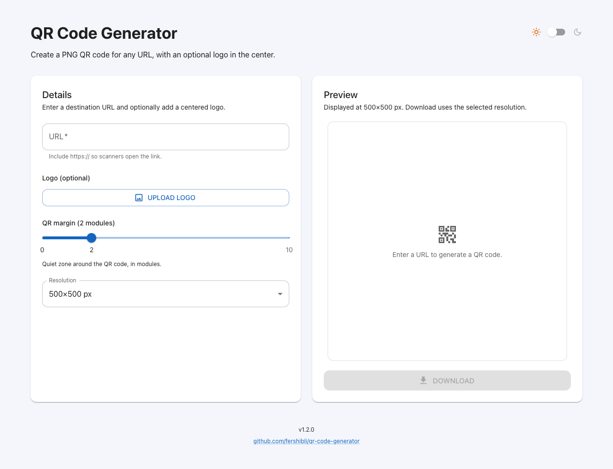
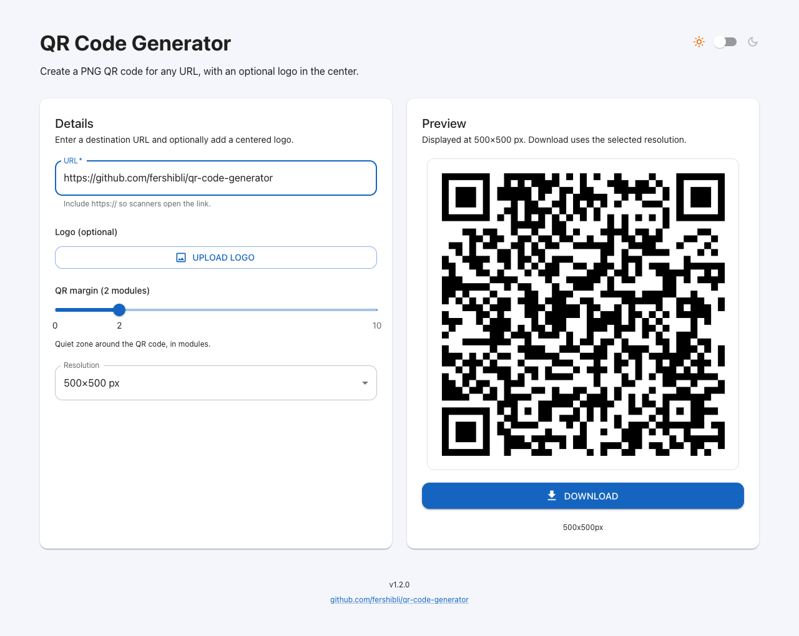
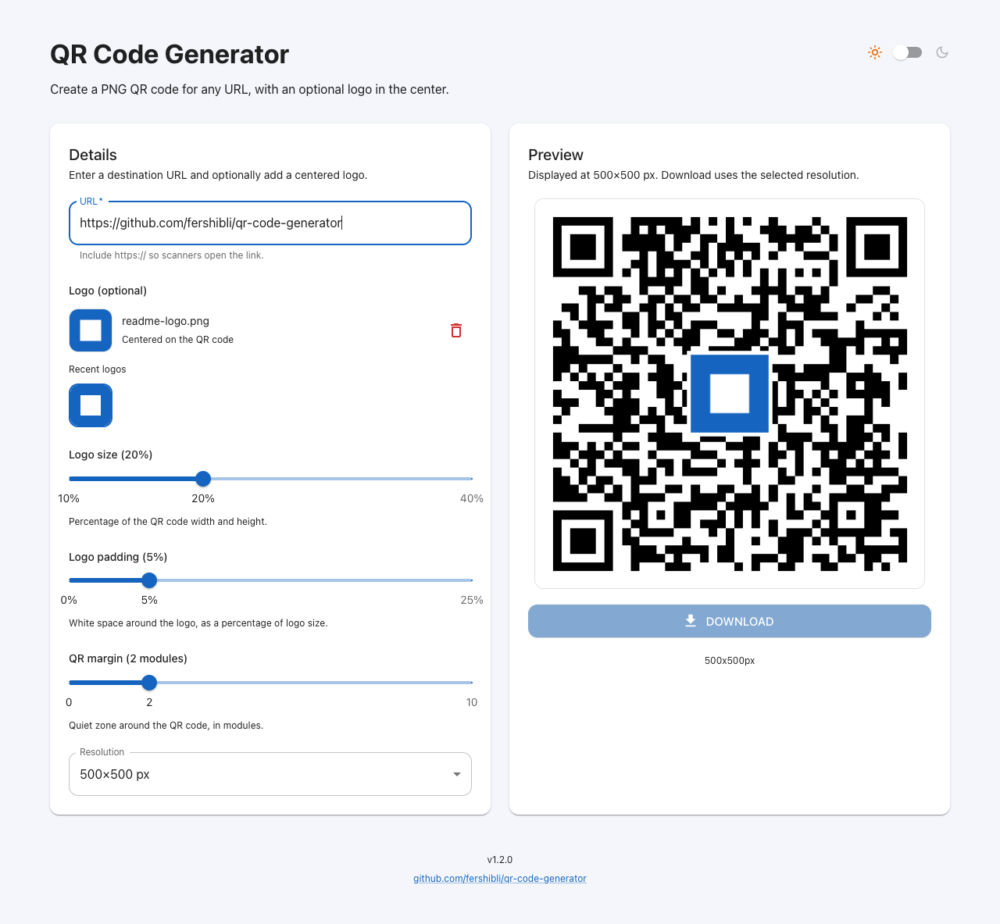
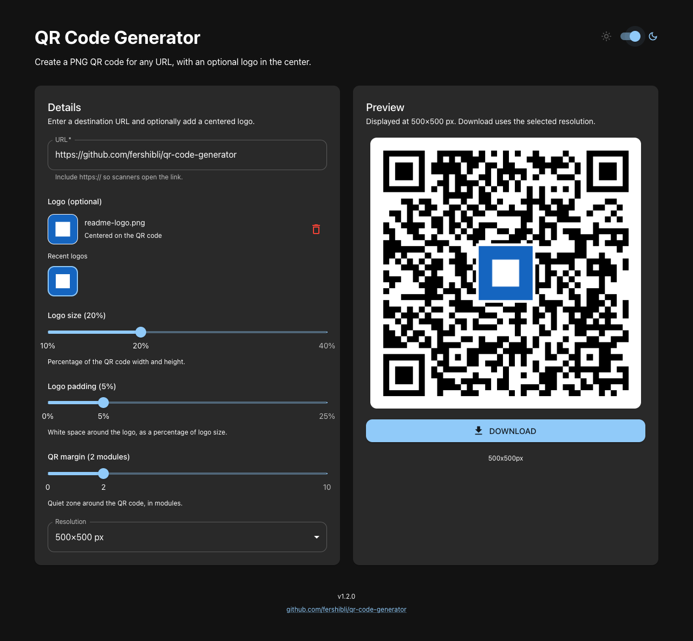
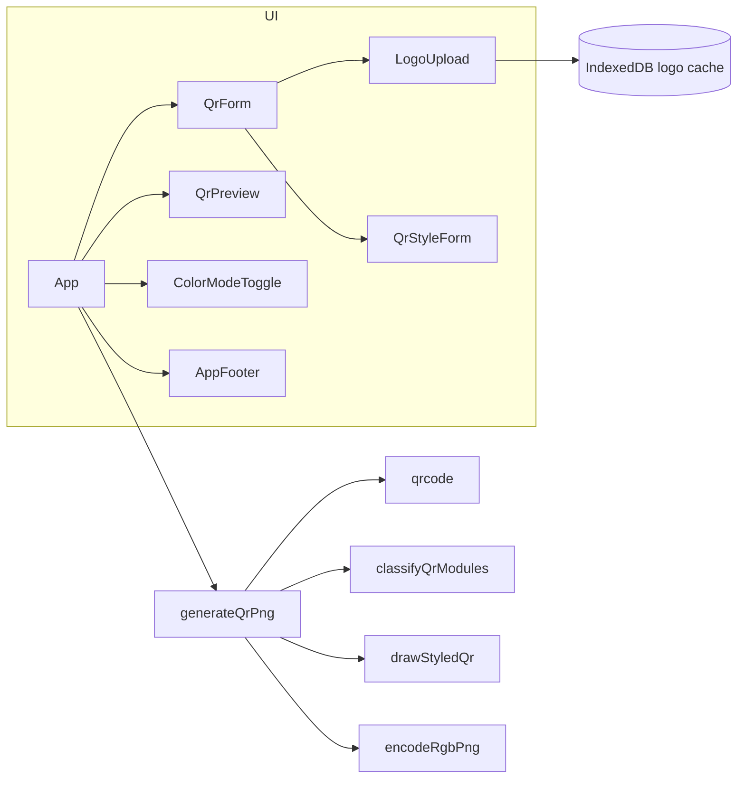

# QR Code Generator

A single-page React app that turns a URL into an RGB PNG QR code, with an optional centered logo.

**Live:** [fershibli.github.io/qr-code-generator](https://fershibli.github.io/qr-code-generator/)

## Table of contents

- [Features](#features)
- [How to use](#how-to-use)
- [Architecture](#architecture)
- [Tech stack](#tech-stack)
- [Development](#development)
- [Deploy](#deploy)
- [Backlog](#backlog)

## Features

- Encode any URL into a square PNG QR code (no alpha channel).
- Optional centered logo, with size and padding sliders that appear only after a logo is selected.
- Collapsible **Customize style** controls for quiet-zone, data, finder, alignment, and timing colors and shapes. Finder and alignment shapes apply to the whole pattern (square, rounded, circle, or triangle), not each module.
- On desktop the form scrolls inside the left card so the preview stays in view. On mobile the preview sits above the form; a compact 20vh bar (QR + Download) appears only while that card is scrolled out of view.
- Optional transparent logo backing so QR modules show through around the logo (the PNG stays opaque RGB). The switch is on the form, below the logo upload, and only appears after a logo is selected.
- Adjustable quiet-zone margin (0–10 modules).
- Export resolution from 250×250 through 1750×1750 px, in 250 px steps.
- Live preview always shown at 500×500 CSS pixels; download uses the selected resolution.
- Light and dark theme, following the system by default or a stored preference.
- Last 8 logos cached in IndexedDB for one-click reuse (removing the current logo does not clear the cache).
- Footer with the app version and a link to this repository.

## How to use

Open the [live app](https://fershibli.github.io/qr-code-generator/) or run it locally with `npm install` and `npm run dev`.

### 1. Start from the empty generator

The left card is the form. The right card stays empty until a URL is entered; **Download** is disabled.



### 2. Enter a URL

Type a full URL including `https://` so scanners open the link. The preview updates after a short debounce.



- **QR margin** is the quiet zone around the code, in modules (default 2).
- **Resolution** is the exported PNG size. The preview stays 500×500 px; the caption under **Download** shows the file size, such as `500x500px`.
- **Customize style** expands a Style section on the same card: quiet-zone and data colors, finder/alignment/timing colors and shapes (square, rounded, circle, or triangle), and **Reset to default**. Finder and alignment use one shape for the whole mark.

### 3. Optionally add a logo

**Upload logo** accepts an image. Logo size (10–40%), logo padding (0–25%), and **Transparent logo background** appear only when a file is selected. Recent logos stay under the upload control for reuse. Transparent backing skips the opaque rectangle behind the logo so modules (and the logo’s own pixels) show through.



Click **Download** to save `qr-code-{n}x{n}.png`. Removing the current logo does not delete it from recents.

### 4. Switch light and dark mode

Use the sun/moon switch in the header. The choice is stored in `localStorage` (`color-mode`). The QR preview frame uses the quiet-zone color so it matches the exported PNG.



## Architecture

The UI is a single page. `App` owns form state, debounces generation, and hands a blob to the preview for download. QR drawing is client-side: `qrcode` builds the bit matrix (`QRCode.create`), modules are classified and painted on a canvas with per-region colors and shapes, an optional logo is composited in the center, and a custom encoder writes an RGB PNG (color type 2) via `fflate`.



Components live in colocated folders (`Component.tsx`, tests, stories, barrel `index.ts`):

```
src/
  App.tsx
  main.tsx
  theme.ts
  constants.ts
  qrStyle.ts
  components/
    QrForm/
    QrStyleForm/
    QrPreview/
    LogoUpload/
    ColorModeProvider/
    ColorModeToggle/
    AppFooter/
  hooks/useColorMode.ts
  utils/
    generateQrPng.ts
    drawStyledQr.ts
    classifyQrModules.ts
    encodeRgbPng.ts
    logoCache.ts
```

Storybook (`.storybook/`) wraps stories in `ColorModeProvider` so light/dark matches the app. It is for local development and CI; it is not published to GitHub Pages.

## Tech stack

| Area | Choice |
| --- | --- |
| UI | React 19, Material UI 9, Emotion |
| QR rendering | `qrcode` bit matrix, custom styled canvas draw, RGB PNG encoder (`fflate`) |
| Logo cache | IndexedDB (`fake-indexeddb` in tests) |
| Build | Vite 8, TypeScript |
| Tests | Vitest, Testing Library, v8 coverage (80% gate) |
| Component workshop | Storybook 10 (`@storybook/react-vite`, addon-docs, addon-themes) |
| Lint | Oxlint |
| CI / CD | GitHub Actions: Pages deploy, semantic-release, Test workflow |
| Hosting | GitHub Pages |

## Development

Requires Node 22 and npm 11 (the lockfile needs npm 11).

```bash
npm install
npm run dev
```

| Script | Purpose |
| --- | --- |
| `npm run dev` | Vite dev server |
| `npm run build` | Typecheck and production bundle |
| `npm run preview` | Serve the production bundle |
| `npm test` | Vitest once |
| `npm run test:watch` | Vitest watch |
| `npm run test:coverage` | Vitest with 80% line/branch/function/statement thresholds |
| `npm run storybook` | Storybook on port 6006 |
| `npm run build-storybook` | Static Storybook build (CI) |
| `npm run lint` | Oxlint |

Pull requests must keep coverage at or above 80% and the Storybook build must succeed.

## Deploy

Pushes to `main`:

1. **GitHub Pages** — `.github/workflows/pages.yml` builds with `BASE_PATH=/qr-code-generator/` and publishes `dist`. It also rebuilds when a GitHub Release is published, so the footer can show the new tag.
2. **Release** — `.github/workflows/release.yml` runs [semantic-release](https://semantic-release.gitbook.io/) when commits follow [Conventional Commits](https://www.conventionalcommits.org/) (`feat` → minor, `fix` → patch, `BREAKING CHANGE` → major). It creates a GitHub Release and git tag via the API (it does not push a version commit to `main`, which would be blocked by the required **Test** check).

Pull requests run `.github/workflows/test.yml` (`npm run test:coverage` and `npm run build-storybook`). The **Test** check is required on `main`.

## Backlog

Ideas that are not in the app yet:

- Other payload types (Wi-Fi, vCard, email, plain text) besides URL.
- A contrast check so styled colors stay scannable.
- SVG export in addition to PNG.
- Drag-and-drop onto the logo upload area.
- Copy PNG to the clipboard, in addition to download.
- PWA / installable shell for offline use of the last generated code.
- Error-correction level control (today it is fixed at `H` so logos remain readable).
